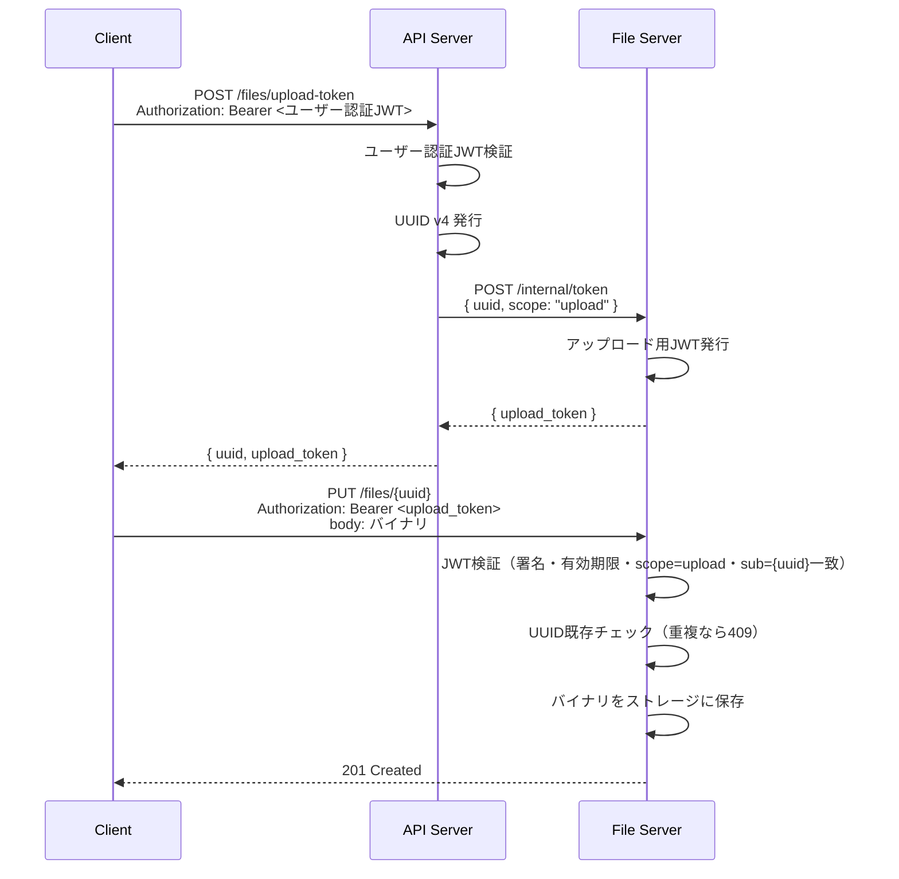
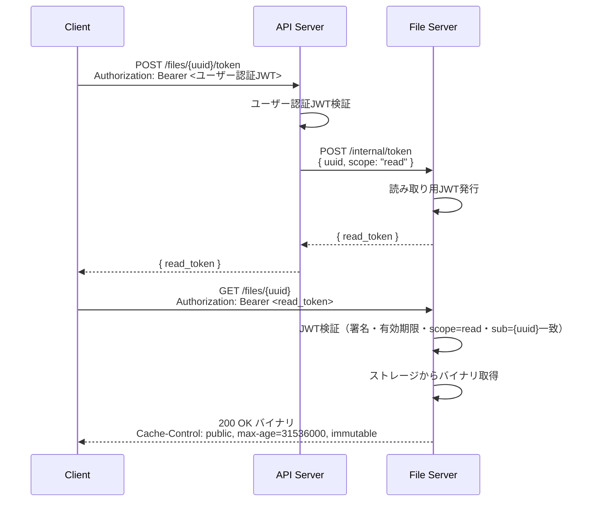
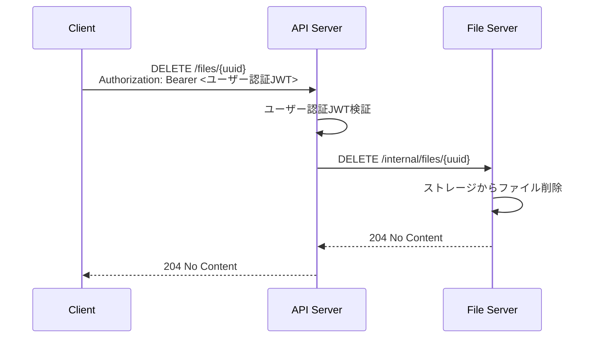

# kaft 設計・仕様規約

## リポジトリ規約設計（refs #1）

### 概要

kigawa-net/dilot を参考に、kaft リポジトリの開発規約・作業フロー・AI エージェント向けガイドラインを整備する。

### 作成・変更ファイル一覧（#1）

| ファイル | 変更種別 | 内容 |
|---|---|---|
| `CLAUDE.md` | 新規作成 | AI エージェント向けの作業フロー・ルール |
| `docs/dev.md` | 新規作成 | 開発規約（Git 運用・ブランチ戦略・コミット規約） |
| `docs/spec.md` | 新規作成（本ファイル） | 設計・仕様規約 |

### 規約内容の方針

dilot の規約をベースに、以下の内容を kaft 向けに整備する。

#### ブランチ戦略

| ブランチ | 用途 |
|---|---|
| `main` | リリース済みの安定版 |
| `develop` | 統合ブランチ。feature/fix ブランチのマージ先 |
| `plan/<issue番号>-<名前>` | 実装計画ドキュメント作成用 |
| `feature/<issue番号>-<名前>` | 機能追加 |
| `fix/<issue番号>-<名前>` | バグ修正 |

#### 作業フロー

1. **issue 確認** — 対象 issue が存在することを確認する
2. **計画 PR 作成・マージ** — `plan/<issue番号>-<名前>` ブランチで `docs/spec.md` に実装計画を記述し PR を作成する（マージ前に実装開始禁止）
3. **実装ブランチ作成** — 計画 PR マージ後に `feature/` または `fix/` ブランチを作成する
4. **コミット** — メッセージ末尾に `refs #<issue番号>` または `fix #<issue番号>` を含める
5. **PR 作成** — `develop` への PR を作成する

#### コミットメッセージ形式

```
<type>: <概要>

refs #<issue番号>
```

type 一覧: `feat`, `fix`, `refactor`, `test`, `docs`, `chore`

#### PR 規約

| 状況 | キーワード |
|---|---|
| 実装完了 PR（issue を閉じる） | `Closes #<番号>` |
| 計画 PR・作業途中 PR | `refs #<番号>` |

#### コミュニケーション規約

- 会話・説明・レビューは日本語で行う
- コード識別子・コマンド・ログは原文のまま扱う

---

## 画像配信基盤の設計（refs #2）

### 概要

UUID で識別されたファイルを、JWT で認可制御しながら immutable に配信する基盤を設計・実装する。

### 設計方針

| 項目 | 方針 |
|---|---|
| ファイル識別子 | UUID v4（アップロード時に発行） |
| アクセス制御 | JWT（署名付き・有効期限あり） |
| immutability | 同一 UUID のファイルは内容を変更しない。更新は新規 UUID で再アップロード |
| URL 設計 | `/files/{uuid}` — JWT はクエリパラメータまたは `Authorization` ヘッダで渡す |

### コンポーネント構成

```
┌──────────┐     ┌─────────────┐     ┌─────────────┐
│  Client  │────▶│  API Server │     │ File Server │
│          │     │  (JWT発行)  │     │ (ファイル   │
│          │─────────────────────────▶│  保存・配信)│
└──────────┘     └─────────────┘     └─────────────┘
```

| コンポーネント | 役割 |
|---|---|
| Client | アップロード・取得・削除を要求する |
| API Server | ユーザー認証・UUID 発行・アップロード用 JWT 発行 |
| File Server | JWT 検証・UUID をキーにした immutable ファイル保存・配信 |

### エンドポイント一覧

**API Server**

| メソッド | パス | 説明 |
|---|---|---|
| `POST` | `/files/upload-token` | UUID 発行・アップロード用 JWT 発行 |
| `POST` | `/files/{uuid}/token` | 読み取り用 JWT 発行 |
| `DELETE` | `/files/{uuid}` | ファイル削除（File Server へ委譲） |

**File Server**

| メソッド | パス | 説明 |
|---|---|---|
| `PUT` | `/files/{uuid}` | ファイルアップロード（Client から直接） |
| `GET` | `/files/{uuid}` | ファイル取得（Client から直接） |
| `POST` | `/internal/token` | JWT 発行（API Server からのみ） |
| `DELETE` | `/internal/files/{uuid}` | ファイル削除（API Server からのみ） |

### アップロード処理フロー



### ファイル取得フロー



### ファイル削除フロー



### JWT ペイロード設計

```json
{
  "sub": "<uuid>",       // 対象ファイルの UUID
  "exp": 1234567890,     // 有効期限（Unix 時刻）
  "iat": 1234567000,     // 発行時刻
  "scope": "upload"      // 権限スコープ（upload / read / delete）
}
```

### immutability の保証

- ストレージへの書き込みは新規 UUID キーへの一度きりのみ
- 既存 UUID への**上書き・更新 API は提供しない**（409 Conflict を返す）
- **削除は可能**（`DELETE /files/{uuid}`）
- キャッシュヘッダに `Cache-Control: public, max-age=31536000, immutable` を付与

### 技術スタック

| 項目 | 採用技術 |
|---|---|
| 言語 | Kotlin |
| フレームワーク | Ktor |
| JWT ライブラリ | `io.ktor:ktor-server-auth-jwt` |
| ビルドツール | Gradle (Kotlin DSL) |

### 作成・変更ファイル一覧（#2）

| ファイル | 変更種別 | 内容 |
|---|---|---|
| `build.gradle.kts` | 新規作成 | Gradle ビルド設定（Ktor・JWT 依存を含む） |
| `src/main/kotlin/Application.kt` | 新規作成 | Ktor アプリケーションエントリポイント |
| `src/main/kotlin/routes/FileRoutes.kt` | 新規作成 | `/files` エンドポイント定義 |
| `src/main/kotlin/storage/FileStorage.kt` | 新規作成 | ストレージ操作（UUID キー読み書き・削除） |
| `src/main/kotlin/auth/JwtService.kt` | 新規作成 | JWT 発行・検証ロジック |
| `src/test/kotlin/` | 新規作成 | 各コンポーネントのテスト |
