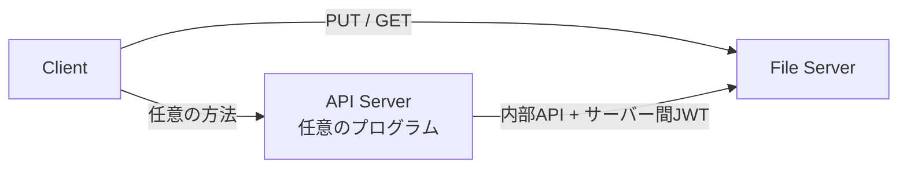
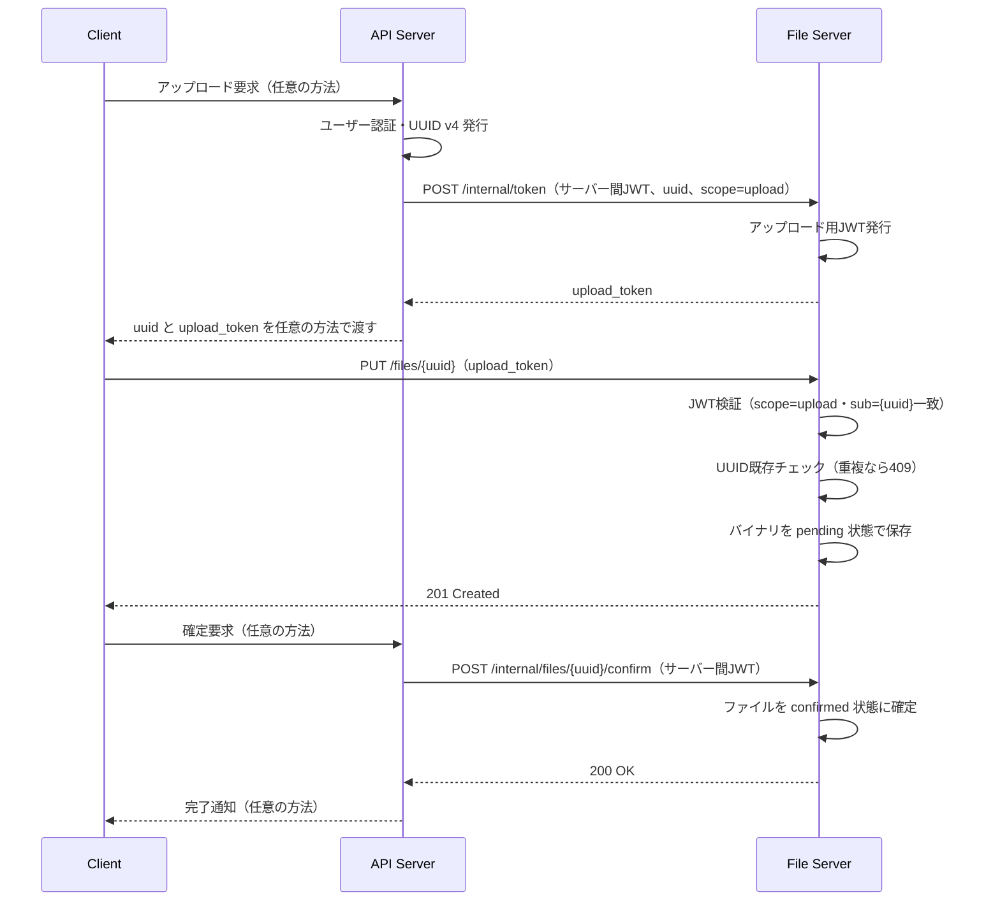
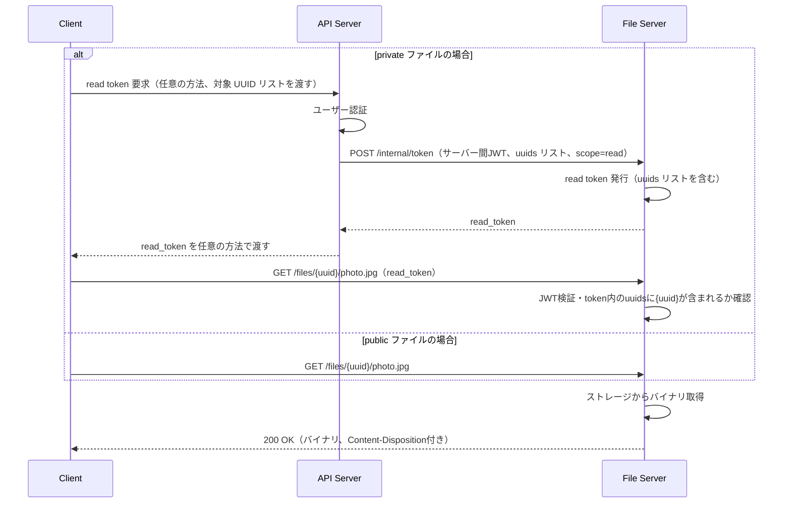
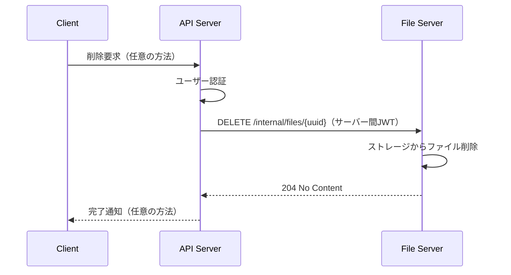
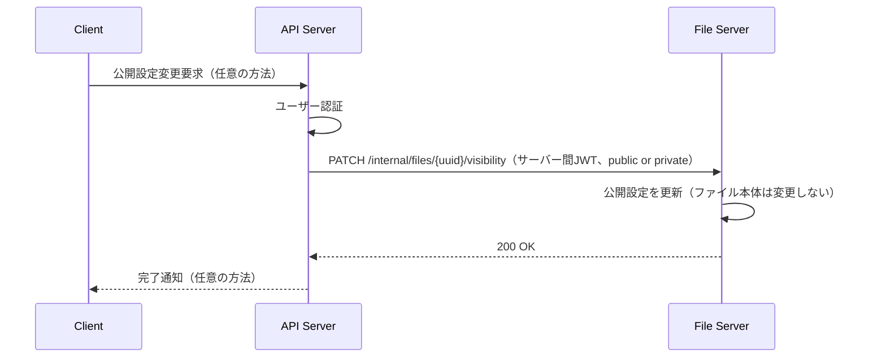

# kaft 設計・仕様規約

## k8s デプロイ設計（refs #7）

### 概要

kaft（Kotlin/Ktor ファイルサーバ）を Kubernetes 上にデプロイするための Dockerfile および k8s マニフェストを作成する。
ファイルストレージは PersistentVolumeClaim で永続化し、シークレットは k8s Secret で管理する。

### 設計方針

| 項目 | 方針 |
|---|---|
| コンテナビルド | Gradle multi-stage build で fat JAR を生成し、JRE のみの runtime イメージで実行 |
| ファイル永続化 | PersistentVolumeClaim を Deployment にマウントし `/data/kaft-storage` に保存 |
| 設定管理 | 非機密設定は ConfigMap、JWT シークレットは Secret で管理 |
| ポート公開 | ClusterIP Service でクラスタ内に 8080 ポートを公開 |
| Namespace | `kaft` Namespace を作成してリソースを分離 |

### ディレクトリ構成

```
kaft/
├── Dockerfile
└── k8s/
    ├── namespace.yaml
    ├── configmap.yaml
    ├── secret.example.yaml  # リポジトリに含める雛形（値はプレースホルダ）
    ├── pvc.yaml
    ├── deployment.yaml
    └── service.yaml
```

### 環境変数マッピング

| 環境変数 | ソース | 内容 |
|---|---|---|
| `PORT` | ConfigMap | リッスンポート（`8080`） |
| `KAFT_STORAGE_PATH` | ConfigMap | ストレージパス（`/data/kaft-storage`） |
| `KAFT_JWT_ISSUER` | ConfigMap | JWT 発行者識別子（`kaft`） |
| `KAFT_JWT_EXPIRATION_SECONDS` | ConfigMap | JWT 有効期限（秒）（`3600`） |
| `KAFT_JWT_SECRET` | Secret | JWT 署名シークレット |
| `KAFT_INTERNAL_JWT_SECRET` | Secret | サーバー間通信 JWT シークレット |

### Dockerfile 設計

```dockerfile
# Stage 1: ビルド
FROM gradle:8-jdk21 AS builder
WORKDIR /app
COPY . .
RUN gradle shadowJar --no-daemon

# Stage 2: ランタイム
FROM eclipse-temurin:21-jre
WORKDIR /app
COPY --from=builder /app/build/libs/*-all.jar app.jar
EXPOSE 8080
ENTRYPOINT ["java", "-jar", "app.jar"]
```

### k8s リソース設計

**Namespace（`k8s/namespace.yaml`）**

- Name: `kaft`

**ConfigMap（`k8s/configmap.yaml`）**

| キー | 値 |
|---|---|
| `PORT` | `8080` |
| `KAFT_STORAGE_PATH` | `/data/kaft-storage` |
| `KAFT_JWT_ISSUER` | `kaft` |
| `KAFT_JWT_EXPIRATION_SECONDS` | `3600` |

**Secret（`k8s/secret.example.yaml`）**

| キー | 内容 |
|---|---|
| `KAFT_JWT_SECRET` | JWT 署名シークレット（プレースホルダ） |
| `KAFT_INTERNAL_JWT_SECRET` | 内部通信 JWT シークレット（プレースホルダ） |

**PersistentVolumeClaim（`k8s/pvc.yaml`）**

| 項目 | 値 |
|---|---|
| Name | `kaft-storage` |
| AccessMode | `ReadWriteOnce` |
| Storage | `10Gi` |

**Deployment（`k8s/deployment.yaml`）**

| 項目 | 値 |
|---|---|
| replicas | `1`（PVC が RWO のため） |
| image | `ghcr.io/kigawa01/kaft:latest` |
| envFrom | ConfigMap `kaft-config` + Secret `kaft-secret` |
| volumeMount | PVC `kaft-storage` → `/data/kaft-storage` |
| readinessProbe | TCP 8080（initialDelaySeconds: 10） |
| livenessProbe | TCP 8080（initialDelaySeconds: 30） |

**Service（`k8s/service.yaml`）**

| 項目 | 値 |
|---|---|
| type | `ClusterIP` |
| port | `8080` |
| targetPort | `8080` |

### 作成・変更ファイル一覧（#7）

| ファイル | 変更種別 | 内容 |
|---|---|---|
| `Dockerfile` | 新規作成 | multi-stage ビルド定義 |
| `.dockerignore` | 新規作成 | ビルドに不要なファイルを除外 |
| `k8s/namespace.yaml` | 新規作成 | `kaft` Namespace |
| `k8s/configmap.yaml` | 新規作成 | 非機密設定 |
| `k8s/secret.example.yaml` | 新規作成 | Secret 雛形（値はプレースホルダ） |
| `k8s/pvc.yaml` | 新規作成 | ファイルストレージ用 PVC |
| `k8s/deployment.yaml` | 新規作成 | アプリ Deployment |
| `k8s/service.yaml` | 新規作成 | ClusterIP Service |
| `.gitignore` | 更新 | `k8s/secret.yaml` を除外に追加 |

---

## リポジトリ規約設計（refs #1）

### 概要

kigawa-net/dilot を参考に、kaft リポジトリの開発規約・作業フロー・AI エージェント向けガイドラインを整備する。

### 作成・変更ファイル一覧（#1）

| ファイル | 変更種別 | 内容 |
|---|---|---|
| `CLAUDE.md` | 新規作成 | AI エージェント向けの作業フロー・ルール |
| `docs/dev.md` | 新規作成 | 開発規約（Git 運用・ブランチ戦略・コミット規約） |
| `docs/spec.md` | 新規作成（本ファイル） | 設計・仕様規約 |

### 規約内容の方針

dilot の規約をベースに、以下の内容を kaft 向けに整備する。

#### ブランチ戦略

| ブランチ | 用途 |
|---|---|
| `main` | リリース済みの安定版 |
| `develop` | 統合ブランチ。feature/fix ブランチのマージ先 |
| `plan/<issue番号>-<名前>` | 実装計画ドキュメント作成用 |
| `feature/<issue番号>-<名前>` | 機能追加 |
| `fix/<issue番号>-<名前>` | バグ修正 |

#### 作業フロー

1. **issue 確認** — 対象 issue が存在することを確認する
2. **計画 PR 作成・マージ** — `plan/<issue番号>-<名前>` ブランチで `docs/spec.md` に実装計画を記述し PR を作成する（マージ前に実装開始禁止）
3. **実装ブランチ作成** — 計画 PR マージ後に `feature/` または `fix/` ブランチを作成する
4. **コミット** — メッセージ末尾に `refs #<issue番号>` または `fix #<issue番号>` を含める
5. **PR 作成** — `develop` への PR を作成する

#### コミットメッセージ形式

```
<type>: <概要>

refs #<issue番号>
```

type 一覧: `feat`, `fix`, `refactor`, `test`, `docs`, `chore`

#### PR 規約

| 状況 | キーワード |
|---|---|
| 実装完了 PR（issue を閉じる） | `Closes #<番号>` |
| 計画 PR・作業途中 PR | `refs #<番号>` |

#### コミュニケーション規約

- 会話・説明・レビューは日本語で行う
- コード識別子・コマンド・ログは原文のまま扱う

---

## 画像配信基盤の設計（refs #2）

### 概要

UUID で識別されたファイルを、JWT で認可制御しながら immutable に配信する基盤を設計・実装する。
File Server が JWT 発行・ファイル操作の全エンドポイントを持つ。API Server は任意のプログラムが担い、ユーザー認証と File Server への橋渡しを行う。

### 設計方針

| 項目 | 方針 |
|---|---|
| ファイル識別子 | UUID v4（API Server がアップロード要求時に発行） |
| JWT 発行 | File Server が発行。API Server は任意の方法で Client に渡す |
| サーバー間認証 | API Server → File Server 間も JWT で認証 |
| immutability | ファイル本体は変更不可。公開設定（public/private）のみ変更可 |
| 公開設定 | public: read token 不要 / private: read token 必須 |
| ファイル名指定 | GET リクエスト時にクエリパラメータでファイル名を指定可能 |

### コンポーネント構成



| コンポーネント | 役割 |
|---|---|
| Client | File Server に対してファイル操作を行う |
| API Server | ユーザー認証・UUID 発行・File Server からの JWT 取得と Client への受け渡し（方法は任意） |
| File Server | JWT 発行・検証・ファイル保存・配信・公開設定管理 |

### File Server エンドポイント一覧

**Client 向け**

| メソッド | パス | 説明 |
|---|---|---|
| `PUT` | `/files/{uuid}` | ファイルアップロード（upload token 必須） |
| `GET` | `/files/{uuid}/{filename}` | ファイル取得。public は token 不要、private は read token 必須。パスのファイル名がそのまま Content-Disposition に使用される |

**API Server 向け内部 API**

| メソッド | パス | 説明 |
|---|---|---|
| `POST` | `/internal/token` | JWT 発行（upload token / read token） |
| `POST` | `/internal/files/{uuid}/confirm` | アップロード確定 |
| `DELETE` | `/internal/files/{uuid}` | ファイル削除 |
| `PATCH` | `/internal/files/{uuid}/visibility` | 公開設定変更 |

### アップロード処理フロー



### ファイル取得フロー



### ファイル削除フロー



### 公開設定変更フロー



### JWT ペイロード設計

**アップロード用 JWT**

```json
{
  "sub": "<uuid>",
  "exp": 1234567890,
  "iat": 1234567000,
  "scope": "upload"
}
```

**読み取り用 JWT**

```json
{
  "uuids": ["<uuid1>", "<uuid2>"],
  "exp": 1234567890,
  "iat": 1234567000,
  "scope": "read"
}
```

**サーバー間 JWT（API Server → File Server）**

```json
{
  "iss": "api-server",
  "exp": 1234567890,
  "iat": 1234567000,
  "scope": "internal"
}
```

### immutability の保証

- ファイル本体はアップロード後に変更不可（上書きリクエストは 409 Conflict）
- 公開設定（public/private）はファイル本体と分離して管理し変更可能
- 削除は API Server 経由で可能
- public ファイルのキャッシュヘッダ: `Cache-Control: public, max-age=31536000, immutable`

### 技術スタック

| 項目 | 採用技術 |
|---|---|
| 言語 | Kotlin |
| フレームワーク | Ktor |
| JWT ライブラリ | `io.ktor:ktor-server-auth-jwt` |
| ビルドツール | Gradle (Kotlin DSL) |

### 作成・変更ファイル一覧（#2）

| ファイル | 変更種別 | 内容 |
|---|---|---|
| `build.gradle.kts` | 新規作成 | Gradle ビルド設定（Ktor・JWT 依存を含む） |
| `src/main/kotlin/Application.kt` | 新規作成 | Ktor アプリケーションエントリポイント |
| `src/main/kotlin/routes/FileRoutes.kt` | 新規作成 | Client 向けエンドポイント（PUT / GET） |
| `src/main/kotlin/routes/InternalRoutes.kt` | 新規作成 | API Server 向け内部エンドポイント |
| `src/main/kotlin/storage/FileStorage.kt` | 新規作成 | ストレージ操作（UUID キー読み書き・削除・公開設定管理） |
| `src/main/kotlin/auth/JwtService.kt` | 新規作成 | JWT 発行・検証ロジック |
| `src/test/kotlin/` | 新規作成 | 各コンポーネントのテスト |
