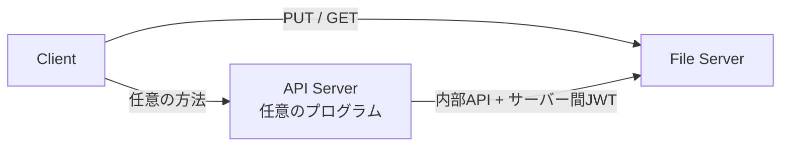
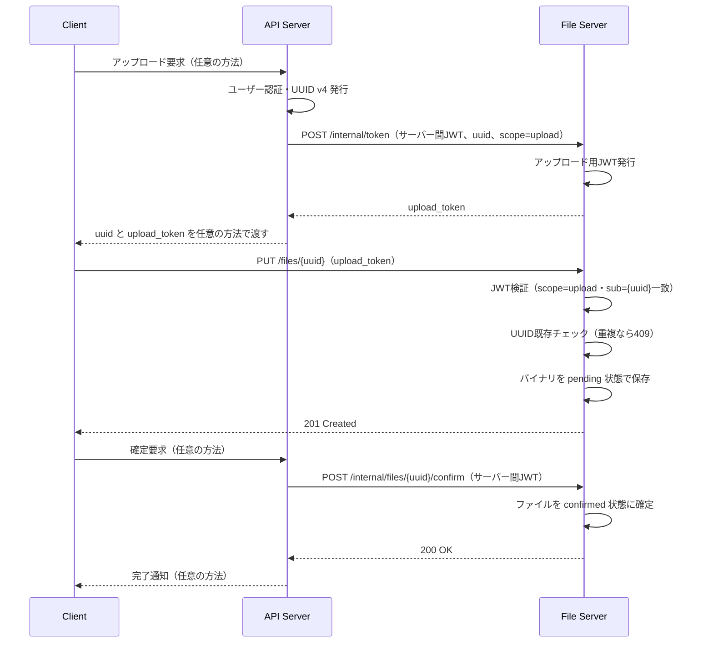
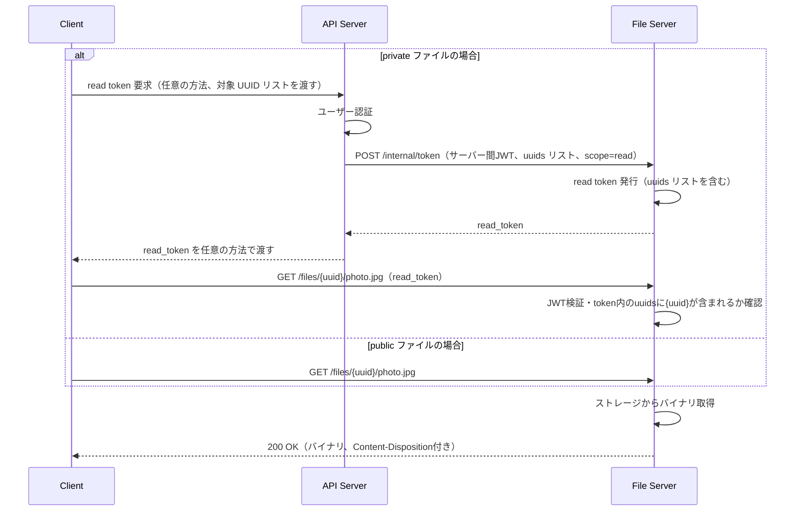
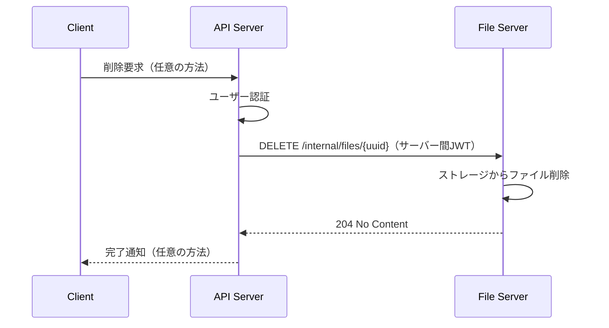
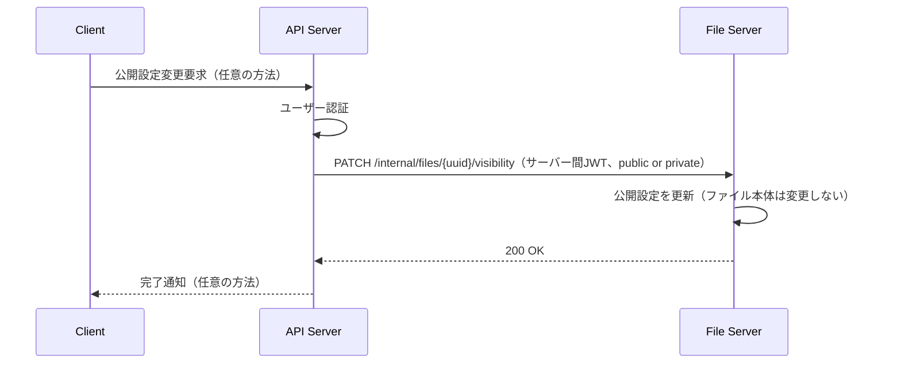

# kaft 設計・仕様規約

## Storage I/Oを非同期化しKtorのblockingを回避する（refs #22）

### 概要

`FileStorage`のI/O操作は`createPending`以外すべて同期関数であり、Local backendは`java.nio.file.Files`、
R2 backendは同期版`S3Client`をKtorのrequest coroutine上で直接blockingに実行している。`FileStorage`の
全メソッドを`suspend fun`にし、blockingな実処理は`Dispatchers.IO`へ分離する。

### 設計方針（S3AsyncClientへの移行は見送る判断について）

| 項目 | 方針 |
|---|---|
| `FileStorage`インターフェース | 全メソッドを`suspend fun`にする |
| Local backend | 各メソッドの実装本体を`withContext(Dispatchers.IO) { ... }`でラップする |
| R2 backend | **`S3AsyncClient`への移行は行わない。** 既存の同期`S3Client`呼び出しを`withContext(Dispatchers.IO) { ... }`でラップする方式を採用する |
| ルート層（`FileRoutes.kt`/`InternalRoutes.kt`） | Ktorのルートハンドラは元々suspendラムダのため、`FileStorage`呼び出し箇所のコード変更は不要（シグネチャがsuspendになるだけで呼び出し構文は同一） |

**S3AsyncClient見送りの理由**: issue本文でも「R2 backendは**可能であれば**S3AsyncClientなど非同期クライアントへ移行する」と条件付きの記載になっている。`S3AsyncClient`は`AsyncRequestBody`/`AsyncResponseTransformer`がReactive Streams（`Publisher<ByteBuffer>`）ベースであり、現在Ktorの`ByteReadChannel`（コルーチンベース）で統一している#21のストリーミング実装と直接互換性がない。ブリッジには自前のPublisher実装が必要になり複雑性・リスクが大きく、既存のテスト基盤（mockなし）でも検証が困難。一方、`withContext(Dispatchers.IO)`によるラップは完了条件（「request coroutine上で重いblocking I/Oを直接実行しない」「FileStorageのI/O APIがcoroutine friendlyになる」「Local/R2双方で既存の機能を維持する」）を全て満たす標準的なKotlin coroutinesのイディオムであり、挙動を一切変えずに安全に達成できる。将来的に本格的な非同期化が必要になった場合は別issueで検討する。

### 変更内容

**`storage/FileStorage.kt`**

```kotlin
interface FileStorage {
    suspend fun exists(id: FileId): Boolean
    suspend fun createPending(id: FileId, data: ByteReadChannel, size: Long, contentType: String): CreateResult
    suspend fun confirm(id: FileId)
    suspend fun getMeta(id: FileId): FileMeta?
    suspend fun delete(id: FileId)
    suspend fun updateVisibility(id: FileId, visibility: Visibility)
    suspend fun openReadChannel(id: FileId, range: LongRange? = null): ByteReadChannel?
}
```

**`storage/LocalFileStorage.kt`**

- 各`override fun`を`override suspend fun`にし、本体全体を`withContext(Dispatchers.IO) { ... }`でラップする
- `confirm`/`updateVisibility`内の`synchronized(lockFor(id)) { ... }`ブロック内では**suspend関数を呼び出さない**（synchronizedブロック内でのsuspend呼び出しはロック保持中に本当に懸架される危険があり避けるべきというkotlinx.coroutinesの既知の注意点のため）。そのため、`getMeta`のロジックをprivateな非suspendヘルパー`readMetaBlocking(id): FileMeta?`に切り出し、`synchronized`ブロック内ではそちらを呼ぶ。公開の`getMeta`はこのヘルパーを`withContext(Dispatchers.IO)`でラップして呼ぶだけにする

```kotlin
private fun readMetaBlocking(id: FileId): FileMeta? {
    val path = metaPath(id)
    if (!Files.exists(path)) return null
    return Json.decodeFromString(Files.readString(path))
}

override suspend fun getMeta(id: FileId): FileMeta? = withContext(Dispatchers.IO) { readMetaBlocking(id) }

override suspend fun confirm(id: FileId): Unit = withContext(Dispatchers.IO) {
    synchronized(lockFor(id)) {
        val meta = readMetaBlocking(id) ?: error("File not found: $id")
        writeMeta(id, meta.copy(state = FileState.CONFIRMED))
    }
}
```

**`storage/R2FileStorage.kt`**

- 各`override fun`を`override suspend fun`にし、本体を`withContext(Dispatchers.IO) { ... }`でラップする
- `getMetaWithETag`・`updateMetaWithRetry`・`headExists`は非suspendのprivateヘルパーのまま維持し（既にwithContext内から呼ばれるため変更不要）、ロジックは一切変更しない

### 並行性の検証

- `LocalFileStorageTest.kt`に、複数コルーチンから`getMeta`/`exists`を同時に呼び出し、すべて正しい結果を返すことを確認するテストを追加する（`coroutineScope { List(N) { launch { ... } } }`）
- R2 backendは既存のS3Client mockインフラがないため自動テストは見送る（既存issue群と同様の方針）。private helperのロジックは無変更のため、`withContext`によるラップのみのレビューで十分と判断する

### 作成・変更ファイル一覧（#22）

| ファイル | 変更種別 | 内容 |
|---|---|---|
| `src/main/kotlin/net/kigawa/kaft/storage/FileStorage.kt` | 更新 | 全メソッドを`suspend fun`にする |
| `src/main/kotlin/net/kigawa/kaft/storage/LocalFileStorage.kt` | 更新 | `withContext(Dispatchers.IO)`でラップ、`readMetaBlocking`ヘルパーを追加 |
| `src/main/kotlin/net/kigawa/kaft/storage/R2FileStorage.kt` | 更新 | `withContext(Dispatchers.IO)`でラップ |
| `src/test/kotlin/net/kigawa/kaft/storage/LocalFileStorageTest.kt` | 更新 | 既存テストをsuspend呼び出しに追随、並行呼び出しテストを追加 |

---

## ファイル取得でHTTP Range Requestに対応する（refs #26）

### 概要

現在のファイル取得は常にファイル全体を返す。動画・大容量ファイル配信のため、単一range requestに対応し、
`206 Partial Content`・`Content-Range`・`Accept-Ranges`を扱えるようにする。#21（ストリーミング化）完了後の
前提を満たしたため着手する。

### 設計方針

| 項目 | 方針 |
|---|---|
| 対応範囲 | 単一rangeのみ（`bytes=start-end`、`bytes=start-`、`bytes=-suffix`の3形式）。複数range（`bytes=0-99,200-299`のようなmultipart）は非対応とし、その場合はRangeヘッダーを無視してフル200レスポンスを返す（RFC 7233でサーバーが複数range非対応時にRangeを無視するのは許容される挙動） |
| 不正な構文 | パース失敗時はRangeヘッダーを無視し、フル200レスポンスを返す |
| 範囲外指定（unsatisfiable） | `start >= size`（サイズは`FileMeta.size`から取得済み）の場合は`416 Range Not Satisfiable`を返し、`Content-Range: bytes */{size}`を付与する |
| `Accept-Ranges` | GETレスポンス全体（フル・部分どちらも）に`Accept-Ranges: bytes`を付与する |
| `FileStorage.openReadChannel` | `range: LongRange? = null`パラメータを追加する。Local backendは指定位置にシークしたチャネルを返す。R2 backendは`GetObjectRequest.range("bytes=start-end")`でR2自体にRange GETを送り、全体取得を避ける |
| 読み取り量の上限 | ルート層で`copyTo(this, limit = length)`を使い、range指定時・未指定時いずれも転送量を`length`（range指定時は`range.last - range.first + 1`、未指定時は`meta.size`）に揃える。Local backendがシーク後もファイル末尾まで読める実装のままでも、ルート層のlimitで正しい範囲だけがレスポンスされる |

### 変更内容

**`storage/FileStorage.kt`**

```kotlin
interface FileStorage {
    ...
    fun openReadChannel(id: FileId, range: LongRange? = null): ByteReadChannel?
}
```

**`storage/LocalFileStorage.kt`**

```kotlin
override fun openReadChannel(id: FileId, range: LongRange?): ByteReadChannel? {
    if (!Files.exists(dataPath(id))) return null
    val channel = Files.newByteChannel(dataPath(id), StandardOpenOption.READ)
    if (range != null) channel.position(range.first)
    return Channels.newInputStream(channel).toByteReadChannel()
}
```

**`storage/R2FileStorage.kt`**

```kotlin
override fun openReadChannel(id: FileId, range: LongRange?): ByteReadChannel? {
    if (!headExists(dataKey(id))) return null
    val request = GetObjectRequest.builder().bucket(bucket).key(dataKey(id)).apply {
        if (range != null) range("bytes=${range.first}-${range.last}")
    }.build()
    return client.getObject(request).toByteReadChannel()
}
```

**`routes/FileRoutes.kt`**

- Rangeヘッダーをパースするプライベート関数を追加（`sealed interface RangeResult { Absent, NotSatisfiable, data class Satisfiable(range: LongRange) }`）
- GETハンドラ:

```kotlin
val meta = ...
...
call.response.header(HttpHeaders.AcceptRanges, "bytes")

when (val rangeResult = parseRange(call.request.headers[HttpHeaders.Range], meta.size)) {
    RangeResult.NotSatisfiable -> {
        call.response.header(HttpHeaders.ContentRange, "bytes */${meta.size}")
        return@get call.respond(HttpStatusCode.RequestedRangeNotSatisfiable)
    }
    is RangeResult.Satisfiable -> {
        val range = rangeResult.range
        val length = range.last - range.first + 1
        val channel = fileStorage.openReadChannel(fileId, range) ?: return@get call.respond(HttpStatusCode.NotFound)
        call.response.header(HttpHeaders.ContentRange, "bytes ${range.first}-${range.last}/${meta.size}")
        call.respondBytesWriter(
            contentType = ContentType.parse(meta.contentType),
            status = HttpStatusCode.PartialContent,
            contentLength = length,
        ) { channel.copyTo(this, limit = length) }
    }
    RangeResult.Absent -> {
        val channel = fileStorage.openReadChannel(fileId) ?: return@get call.respond(HttpStatusCode.NotFound)
        call.respondBytesWriter(contentType = ContentType.parse(meta.contentType), contentLength = meta.size) {
            channel.copyTo(this, limit = meta.size)
        }
    }
}
```

### テスト

- `FileRoutesTest.kt`
  - `bytes=0-4`のような範囲指定で`206`・正しい`Content-Range`・部分ボディを確認
  - `bytes=start-`（末尾まで）、`bytes=-N`（末尾N byte）の2形式も確認
  - `start >= size`となる範囲外指定で`416`・`Content-Range: bytes */{size}`を確認
  - 不正な構文（例: `bytes=abc`）でRangeが無視されフル`200`が返ることを確認
  - Rangeヘッダー無しの通常GETに`Accept-Ranges: bytes`が付与されることを確認
- R2 backendは既存のS3Client mockインフラがないため自動テストは見送る（#24・#21と同様の方針）

### 作成・変更ファイル一覧（#26）

| ファイル | 変更種別 | 内容 |
|---|---|---|
| `src/main/kotlin/net/kigawa/kaft/storage/FileStorage.kt` | 更新 | `openReadChannel`に`range`パラメータを追加 |
| `src/main/kotlin/net/kigawa/kaft/storage/LocalFileStorage.kt` | 更新 | シーク対応 |
| `src/main/kotlin/net/kigawa/kaft/storage/R2FileStorage.kt` | 更新 | `GetObjectRequest.range()`でR2側にRange GETを送る |
| `src/main/kotlin/net/kigawa/kaft/routes/FileRoutes.kt` | 更新 | Rangeパース・206/416・Accept-Rangesヘッダー対応 |
| `src/test/kotlin/net/kigawa/kaft/FileRoutesTest.kt` | 更新 | Range Requestのテストを追加 |

---

## ファイルのアップロード・ダウンロードをストリーミング化する（refs #21）

### 概要

現在はアップロードで`call.receive<ByteArray>()`、ダウンロードで`getBytes()`/`respondBytes()`を使用しており、
R2 backendでも`readAllBytes()`している。ファイルサイズに比例してJVM heapを消費するため、Ktor 3.1.3の
`ByteReadChannel`/`ByteWriteChannel`を使い、ファイル本体を`ByteArray`として保持せずに逐次転送する。

### 前提調査（Ktor 3.1.3 / ktor-io 3.1.3で存在を確認済みのAPI）

| API | シグネチャ | 用途 |
|---|---|---|
| `ApplicationCall.receiveChannel()` | `suspend fun receiveChannel(): ByteReadChannel` | アップロードのリクエストボディをストリームで受け取る |
| `ApplicationCall.respondBytesWriter()` | `suspend fun respondBytesWriter(contentType, status, contentLength: Long?, block: suspend ByteWriteChannel.() -> Unit)` | ダウンロードレスポンスをストリームで書き出す |
| `HttpMessage.contentLength()` | `fun contentLength(): Long?` | `Content-Length`ヘッダーからサイズを取得（`ApplicationRequest`は`HttpMessage`） |
| `ByteReadChannel.copyTo(ByteWriteChannel, limit)` | `suspend fun copyTo(dst: ByteWriteChannel, limit: Long = Long.MAX_VALUE): Long` | チャネル間の逐次コピー |
| `ByteReadChannel.copyTo(OutputStream, limit)`（`io.ktor.utils.io.jvm.javaio`） | `suspend fun copyTo(out: OutputStream, limit: Long = Long.MAX_VALUE): Long` | Local backendのファイル書き込み |
| `ByteReadChannel.toInputStream()`（同上） | `fun toInputStream(parentJob: Job? = null): InputStream` | 同期のR2 SDKへ渡すためのブロッキング変換 |
| `InputStream.toByteReadChannel()`（同上） | `fun toByteReadChannel(context: CoroutineContext = Dispatchers.IO, ...): ByteReadChannel` | Local/R2のダウンロード時にInputStreamをChannel化 |

### 設計方針

| 項目 | 方針 |
|---|---|
| `FileStorage.createPending` | `data: ByteArray` → `data: ByteReadChannel, size: Long`に変更し、`suspend fun`にする（ストリーム読み取り自体がsuspend操作のため） |
| `FileStorage.getBytes` | 廃止し、`openReadChannel(id: FileId): ByteReadChannel?`に置き換える |
| サイズの取得元 | アップロードリクエストの`Content-Length`ヘッダー（`call.request.contentLength()`）。**`Content-Length`が無いリクエスト（chunked等）は`411 Length Required`を返し拒否する**（サイズ不明のストリームをR2の同期SDKへ渡せないため。将来的にchunked対応が必要なら別issueで検討） |
| Local backend | 書き込みは`ByteReadChannel.copyTo(OutputStream)`、読み取りは`Files.newInputStream(path).toByteReadChannel()` |
| R2 backend | 書き込みは`ByteReadChannel.toInputStream()`で同期`InputStream`に変換し`RequestBody.fromInputStream(stream, size)`へ渡す（同期SDKのため`size`が必須）。読み取りは`GetObjectResponse`の`InputStream`をそのまま`toByteReadChannel()`する（`readAllBytes()`を廃止） |
| ルート層 | `FileRoutes.kt`のPUTは`call.receiveChannel()`を`createPending`に渡す。GETは`respondBytesWriter(contentType, contentLength = meta.size) { fileStorage.openReadChannel(id)!!.copyTo(this) }`を使う |
| 非同期化(Dispatchers.IO分離、R2のS3AsyncClient化) | 本issueでは行わない（#22のスコープ）。あくまで「ByteArrayとして全体を保持しない」ことが目的で、blocking I/Oの分離は別issue |
| `meta.json`の読み書き | サイズが小さいため対象外（従来どおり`readAllBytes`/文字列で扱う） |

### 変更内容

**`storage/FileStorage.kt`**

```kotlin
interface FileStorage {
    fun exists(id: FileId): Boolean
    suspend fun createPending(id: FileId, data: ByteReadChannel, size: Long, contentType: String): CreateResult
    fun confirm(id: FileId)
    fun getMeta(id: FileId): FileMeta?
    fun delete(id: FileId)
    fun updateVisibility(id: FileId, visibility: Visibility)
    fun openReadChannel(id: FileId): ByteReadChannel?
}
```

**`storage/LocalFileStorage.kt`**

```kotlin
override suspend fun createPending(id: FileId, data: ByteReadChannel, size: Long, contentType: String): CreateResult {
    try {
        Files.createDirectory(fileDir(id))
    } catch (_: FileAlreadyExistsException) {
        return CreateResult.AlreadyExists
    }
    Files.newOutputStream(dataPath(id)).use { out -> data.copyTo(out) }
    writeMeta(id, FileMeta(state = PENDING, visibility = PRIVATE, contentType = contentType, size = size))
    return CreateResult.Created
}

override fun openReadChannel(id: FileId): ByteReadChannel? =
    if (Files.exists(dataPath(id))) Files.newInputStream(dataPath(id)).toByteReadChannel() else null
```

**`storage/R2FileStorage.kt`**

```kotlin
override suspend fun createPending(id: FileId, data: ByteReadChannel, size: Long, contentType: String): CreateResult {
    try {
        client.putObject(... ifNoneMatch("*") ..., RequestBody.fromString(metaJson))
    } catch (e: S3Exception) {
        if (e.statusCode() == 412) return CreateResult.AlreadyExists else throw e
    }
    client.putObject(
        PutObjectRequest.builder().bucket(bucket).key(dataKey(id)).build(),
        RequestBody.fromInputStream(data.toInputStream(), size),
    )
    return CreateResult.Created
}

override fun openReadChannel(id: FileId): ByteReadChannel? {
    if (!headExists(dataKey(id))) return null
    return client.getObject(GetObjectRequest.builder().bucket(bucket).key(dataKey(id)).build()).toByteReadChannel()
}
```

**`routes/FileRoutes.kt`**

```kotlin
put("/files/{uuid}") {
    // fileId, token検証は既存どおり
    val size = call.request.contentLength() ?: return@put call.respond(HttpStatusCode.LengthRequired)
    val contentType = call.request.headers[HttpHeaders.ContentType] ?: DEFAULT_CONTENT_TYPE
    when (fileStorage.createPending(fileId, call.receiveChannel(), size, contentType)) {
        CreateResult.Created -> call.respond(HttpStatusCode.Created)
        CreateResult.AlreadyExists -> call.respond(HttpStatusCode.Conflict)
    }
}

get("/files/{uuid}/{filename}") {
    // meta取得・visibility検証は既存どおり
    val channel = fileStorage.openReadChannel(fileId) ?: return@get call.respond(HttpStatusCode.NotFound)
    // ContentDisposition/CacheControlヘッダーは既存どおり設定
    call.respondBytesWriter(contentType = ContentType.parse(meta.contentType), contentLength = meta.size) {
        channel.copyTo(this)
    }
}
```

### テスト

- `FileRoutesTest.kt`
  - 既存テストが`call.receiveChannel()`経由でも通ることを確認（Ktor test clientは`setBody(ByteArray)`で自動的に`Content-Length`を設定するため無変更で通る想定）
  - 数MB規模のランダムバイト列をアップロード・ダウンロードし、内容が一致することを確認する大きめファイルのテストを追加する
  - `Content-Length`が送信されないリクエスト（chunked transfer）で`411 Length Required`になることを確認する
- R2 backendについては、既存のS3Client mockインフラがないため自動テストは見送る（#24と同様の方針）

### 作成・変更ファイル一覧（#21）

| ファイル | 変更種別 | 内容 |
|---|---|---|
| `src/main/kotlin/net/kigawa/kaft/storage/FileStorage.kt` | 更新 | `createPending`をストリーミングAPIに変更、`getBytes`を`openReadChannel`に置き換え |
| `src/main/kotlin/net/kigawa/kaft/storage/LocalFileStorage.kt` | 更新 | ストリーミング読み書きに変更 |
| `src/main/kotlin/net/kigawa/kaft/storage/R2FileStorage.kt` | 更新 | ストリーミング読み書きに変更（同期SDKのため`size`必須） |
| `src/main/kotlin/net/kigawa/kaft/routes/FileRoutes.kt` | 更新 | `receiveChannel`/`respondBytesWriter`に変更、`Content-Length`必須化 |
| `src/test/kotlin/net/kigawa/kaft/FileRoutesTest.kt` | 更新 | 大きめファイル・Content-Length欠如のテストを追加 |

---

## R2メタデータ更新の競合によるlost updateを防止する（refs #24）

### 概要

R2 backendでは`meta.json`に`state`と`visibility`をまとめて保存しており、`confirm`/`updateVisibility`が
read-modify-writeで実装されているため、並行更新時に一方の変更がもう一方を上書きするlost updateが
発生し得る（例: confirmとvisibility更新が競合すると`CONFIRMED`が`PENDING`に戻ってしまう）。

### 設計方針

| 項目 | 方針 |
|---|---|
| R2 backend | ETagを使ったoptimistic concurrency control（CAS）で解決する。`meta.json`取得時にETagを取得し、更新時に`PutObjectRequest.ifMatch(etag)`で条件付き書き込みを行う。412 Precondition Failed（ETag不一致＝競合）の場合は再読み込みして再試行する（最大リトライ回数を設ける） |
| Local backend | 単一プロセス内のスレッド競合が原因のため、`FileId`ごとの`synchronized`ロックで`confirm`/`updateVisibility`のread-modify-writeを直列化する。ネットワーク越しの複数ノード競合はそもそも発生しないため、R2のような条件付き書き込みは不要 |
| リトライ上限超過時 | `IllegalStateException`を送出する（既存の`error("File not found: ...")`と同様のスタイル） |
| 非同期化 | 本issueでは`suspend`化は行わない（#22のスコープ） |
| `createPending`（#20で導入済み） | 既にatomicな作成のため対象外。本issueは`confirm`/`updateVisibility`のみが対象 |

### 変更内容

**`storage/R2FileStorage.kt`**

```kotlin
private fun getMetaWithETag(id: FileId): Pair<FileMeta, String>? {
    if (!headExists(metaKey(id))) return null
    return client.getObject(GetObjectRequest.builder().bucket(bucket).key(metaKey(id)).build()).use {
        Json.decodeFromString<FileMeta>(String(it.readAllBytes())) to it.response().eTag()
    }
}

private fun updateMetaWithRetry(id: FileId, retries: Int = 5, transform: (FileMeta) -> FileMeta) {
    repeat(retries) {
        val (meta, etag) = getMetaWithETag(id) ?: error("File not found: $id")
        try {
            client.putObject(
                PutObjectRequest.builder().bucket(bucket).key(metaKey(id)).ifMatch(etag).build(),
                RequestBody.fromString(Json.encodeToString(transform(meta))),
            )
            return
        } catch (e: S3Exception) {
            if (e.statusCode() != 412) throw e
            // ETag不一致(競合) -> 再読み込みして再試行
        }
    }
    error("Failed to update metadata for $id: too many concurrent conflicts")
}

override fun confirm(id: FileId) = updateMetaWithRetry(id) { it.copy(state = FileState.CONFIRMED) }

override fun updateVisibility(id: FileId, visibility: Visibility) =
    updateMetaWithRetry(id) { it.copy(visibility = visibility) }
```

- 既存の`getMeta(id)`は`getMetaWithETag(id)?.first`を返すように内部実装を共通化する

**`storage/LocalFileStorage.kt`**

```kotlin
private val locks = ConcurrentHashMap<FileId, Any>()
private fun lockFor(id: FileId): Any = locks.computeIfAbsent(id) { Any() }

override fun confirm(id: FileId) = synchronized(lockFor(id)) {
    val meta = getMeta(id) ?: error("File not found: $id")
    writeMeta(id, meta.copy(state = FileState.CONFIRMED))
}

override fun updateVisibility(id: FileId, visibility: Visibility) = synchronized(lockFor(id)) {
    val meta = getMeta(id) ?: error("File not found: $id")
    writeMeta(id, meta.copy(visibility = visibility))
}
```

### テスト

- `LocalFileStorageTest.kt`（新規テストケース追加）
  - `confirm`と`updateVisibility(PUBLIC)`を2スレッドから同時に実行し、完了後に`state == CONFIRMED`かつ`visibility == PUBLIC`（どちらも失われていない）ことを確認する
- R2 backendについては、リポジトリに既存のS3Client mock/テストインフラが存在しないため、本issueでは自動テストの追加を見送る（Local側のロジックとR2側のCASロジックは対称的な設計であり、レビューで論理的に確認する）

### 作成・変更ファイル一覧（#24）

| ファイル | 変更種別 | 内容 |
|---|---|---|
| `src/main/kotlin/net/kigawa/kaft/storage/R2FileStorage.kt` | 更新 | ETagベースのCASで`confirm`/`updateVisibility`を実装 |
| `src/main/kotlin/net/kigawa/kaft/storage/LocalFileStorage.kt` | 更新 | `FileId`ごとの`synchronized`ロックで直列化 |
| `src/test/kotlin/net/kigawa/kaft/storage/LocalFileStorageTest.kt` | 更新 | 並行confirm/updateVisibilityのlost updateテストを追加 |

---

## ファイルのContent-Typeとサイズをメタデータとして保持する（refs #25）

### 概要

現在のGETレスポンスは常に`application/octet-stream`を返しており、アップロード時のContent-Typeや
ファイルサイズを保持していない。`FileMeta`にこれらを追加し、GETで正しいContent-Typeを返せるようにする。

### 設計方針

| 項目 | 方針 |
|---|---|
| `FileMeta`への追加 | `contentType: String`、`size: Long` を追加する |
| Content-Type取得元 | アップロードリクエストの`Content-Type`ヘッダー |
| fallback仕様 | `Content-Type`ヘッダーが未指定の場合は`application/octet-stream`を使用する（route層の定数として定義） |
| Content-Typeの検証 | 値の妥当性検証（MIMEタイプとして正しいか等）は行わない。ヘッダー値をそのまま保存し、GET時にそのまま返す（過剰な検証はスコープ外） |
| size取得元 | アップロードされたバイト列の長さ（`data.size`） |
| Local/R2 | 両backendとも`createPending()`のシグネチャに`contentType`を追加し、同一の`FileMeta`を保存する。挙動は完全に一致する |
| GETレスポンス | `meta.contentType`を`ContentType.parse()`して`respondBytes`に渡す（現行のハードコードされた`ContentType.Application.OctetStream`を置き換える） |

### 変更内容

**`storage/FileStorage.kt`**

```kotlin
@Serializable
data class FileMeta(
    val state: FileState,
    val visibility: Visibility,
    val contentType: String,
    val size: Long,
)

interface FileStorage {
    fun exists(id: FileId): Boolean
    fun createPending(id: FileId, data: ByteArray, contentType: String): CreateResult
    ...
}
```

**`storage/LocalFileStorage.kt` / `storage/R2FileStorage.kt`**

- `createPending`に`contentType`引数を追加し、`FileMeta(state = PENDING, visibility = PRIVATE, contentType = contentType, size = data.size.toLong())`を保存する

**`routes/FileRoutes.kt`**

```kotlin
private const val DEFAULT_CONTENT_TYPE = "application/octet-stream"

// PUT /files/{uuid}
val contentType = call.request.headers[HttpHeaders.ContentType] ?: DEFAULT_CONTENT_TYPE
fileStorage.createPending(fileId, data, contentType)

// GET /files/{uuid}/{filename}
call.respondBytes(data, ContentType.parse(meta.contentType))
```

### テスト

- `FileRoutesTest.kt`
  - Content-Typeを指定してアップロード（例: `image/png`）→ GETレスポンスの`Content-Type`ヘッダーが一致することを確認
  - Content-Type未指定でアップロード → GETレスポンスの`Content-Type`が`application/octet-stream`になることを確認
- `LocalFileStorageTest.kt`
  - `createPending`後の`getMeta()`で`contentType`・`size`が正しく保存されていることを確認

### 作成・変更ファイル一覧（#25）

| ファイル | 変更種別 | 内容 |
|---|---|---|
| `src/main/kotlin/net/kigawa/kaft/storage/FileStorage.kt` | 更新 | `FileMeta`に`contentType`・`size`を追加、`createPending`に`contentType`引数を追加 |
| `src/main/kotlin/net/kigawa/kaft/storage/LocalFileStorage.kt` | 更新 | `createPending`のシグネチャ追随 |
| `src/main/kotlin/net/kigawa/kaft/storage/R2FileStorage.kt` | 更新 | `createPending`のシグネチャ追随 |
| `src/main/kotlin/net/kigawa/kaft/routes/FileRoutes.kt` | 更新 | Content-Type取得・fallback、GETレスポンスのContent-Type変更 |
| `src/test/kotlin/net/kigawa/kaft/FileRoutesTest.kt` | 更新 | Content-Type保持・fallbackのテスト追加 |
| `src/test/kotlin/net/kigawa/kaft/storage/LocalFileStorageTest.kt` | 更新 | メタデータ保存内容のテスト追加 |

---

## アップロード時の存在確認と作成をatomicにする（refs #20）

### 概要

現在のアップロード処理は `fileStorage.exists(id)` の後に `fileStorage.savePending(id, data)` を呼び出しており、
同一UUIDへの並行アップロードでTOCTOU raceが発生し得る。`FileStorage`に「存在確認＋作成」を一体化した
atomic create APIを導入する。

### 設計方針

| 項目 | 方針 |
|---|---|
| API | `FileStorage.savePending(id, data)` を `createPending(id, data): CreateResult` に置き換える |
| `CreateResult` | `sealed interface CreateResult { data object Created; data object AlreadyExists }`（issue記載のとおり） |
| route側 | `FileRoutes.kt`の`PUT /files/{uuid}`で`exists()`事前チェックを廃止し、`createPending()`の結果だけで201/409を判定する |
| 非同期化 | 本issueでは`suspend`化は行わない（#22でまとめて対応するスコープ）。既存の同期APIのまま、backend内部でOS/ストレージレベルのatomic操作を使う |
| Local backend | `Files.createDirectory(dir)`（複数形の`createDirectories`ではない）を使う。ディレクトリ作成はファイルシステムレベルでatomicなため、2つ目以降の呼び出しは`FileAlreadyExistsException`を受け取り`AlreadyExists`を返す。ディレクトリ作成に成功した呼び出しのみデータ・メタを書き込む |
| R2 backend | S3互換の条件付き書き込み（`PutObjectRequest.ifNoneMatch("*")`）を`meta.json`オブジェクトへのPUTに使う。R2は2024年からConditional Writesをサポート済み。precondition failed（HTTP 412）を`AlreadyExists`として扱う。meta書き込みが成功した場合のみdataを書き込む（Local同様、"claim"を先に取ってからデータを書く順序にする） |
| 既存の`exists()`メソッド | `confirm`/`delete`/`updateVisibility`の存在チェックとしてはそのまま維持する（本issueのスコープ外） |

### 変更内容

**`storage/FileStorage.kt`**

```kotlin
sealed interface CreateResult {
    data object Created : CreateResult
    data object AlreadyExists : CreateResult
}

interface FileStorage {
    fun exists(id: FileId): Boolean
    fun createPending(id: FileId, data: ByteArray): CreateResult
    fun confirm(id: FileId)
    fun getBytes(id: FileId): ByteArray?
    fun getMeta(id: FileId): FileMeta?
    fun delete(id: FileId)
    fun updateVisibility(id: FileId, visibility: Visibility)
}
```

**`storage/LocalFileStorage.kt`**

```kotlin
override fun createPending(id: FileId, data: ByteArray): CreateResult {
    try {
        Files.createDirectory(fileDir(id))
    } catch (e: FileAlreadyExistsException) {
        return CreateResult.AlreadyExists
    }
    Files.write(dataPath(id), data)
    writeMeta(id, FileMeta(state = FileState.PENDING, visibility = Visibility.PRIVATE))
    return CreateResult.Created
}
```

**`storage/R2FileStorage.kt`**

```kotlin
override fun createPending(id: FileId, data: ByteArray): CreateResult {
    try {
        client.putObject(
            PutObjectRequest.builder().bucket(bucket).key(metaKey(id)).ifNoneMatch("*").build(),
            RequestBody.fromString(Json.encodeToString(FileMeta(state = FileState.PENDING, visibility = Visibility.PRIVATE))),
        )
    } catch (e: S3Exception) {
        if (e.statusCode() == 412) return CreateResult.AlreadyExists else throw e
    }
    client.putObject(
        PutObjectRequest.builder().bucket(bucket).key(dataKey(id)).build(),
        RequestBody.fromBytes(data),
    )
    return CreateResult.Created
}
```

**`routes/FileRoutes.kt`**

```kotlin
put("/files/{uuid}") {
    val fileId = ...
    val token = ...
    if (!jwtService.verifyUploadToken(token, fileId.toString())) return@put call.respond(Unauthorized)

    val data = call.receive<ByteArray>()
    when (fileStorage.createPending(fileId, data)) {
        is CreateResult.Created -> call.respond(HttpStatusCode.Created)
        is CreateResult.AlreadyExists -> call.respond(HttpStatusCode.Conflict)
    }
}
```

### テスト

- `LocalFileStorageTest.kt`（新規）
  - 新規IDへの`createPending` → `Created`、`exists()`が`true`になる
  - 既存IDへの`createPending`（逐次2回目） → `AlreadyExists`
  - 複数スレッドから同一IDへ同時に`createPending`を呼び出し、`Created`になるのはちょうど1件であることを確認
- `FileRoutesTest.kt`の既存`duplicate upload returns 409`テストは新しい`createPending`経由でも通ることを確認する

### 作成・変更ファイル一覧（#20）

| ファイル | 変更種別 | 内容 |
|---|---|---|
| `src/main/kotlin/net/kigawa/kaft/storage/FileStorage.kt` | 更新 | `CreateResult`追加、`savePending`を`createPending`に置き換え |
| `src/main/kotlin/net/kigawa/kaft/storage/LocalFileStorage.kt` | 更新 | `Files.createDirectory`によるatomic create |
| `src/main/kotlin/net/kigawa/kaft/storage/R2FileStorage.kt` | 更新 | `ifNoneMatch("*")`によるatomic create |
| `src/main/kotlin/net/kigawa/kaft/routes/FileRoutes.kt` | 更新 | `exists()`事前チェックを廃止し`createPending()`の結果で分岐 |
| `src/test/kotlin/net/kigawa/kaft/storage/LocalFileStorageTest.kt` | 新規作成 | 逐次・並行createPendingのテスト |

---

## ファイルIDをUUID型として検証・扱う（refs #19）

### 概要

現在、`/files/{uuid}` などで受け取ったファイルIDを `String` のまま扱っており、`LocalFileStorage` では
`baseDir.resolve(uuid)` にそのまま渡している。不正なUUID文字列を受理してしまい、Local backendでは
任意文字列がパス解決に使われてしまう。ファイルIDはアプリケーション境界でUUIDとして検証し、
`FileStorage` API全体で型として保証する。

### 設計方針

| 項目 | 方針 |
|---|---|
| 型 | `@JvmInline value class FileId(val value: UUID)` を `storage`パッケージに新規追加 |
| 検証タイミング | route parameter受領時（`FileRoutes.kt`・`InternalRoutes.kt`の両方） |
| 検証失敗時 | `400 Bad Request` |
| `FileStorage`のAPI | 全メソッドの引数を `String` → `FileId` に変更する |
| Local/R2 backend | ディレクトリ名・R2オブジェクトキーの構築を `FileId` 経由にする（`FileId.toString()`でUUID文字列を得る。既存のディレクトリ/キー命名と完全互換） |
| JWT検証との連携 | `JwtService.verifyUploadToken`/`verifyReadToken` は現状どおり `String` を受け取るAPIのまま変更しない（本issueのスコープ外）。呼び出し側で `fileId.toString()` を渡す |
| `/internal/token` の `TokenRequest.uuid`/`uuids`（リクエストボディ） | Storage層に渡らないため本issueのスコープ外とする（JWT発行ロジックの型強化は将来issueで検討） |

### 変更内容

**`storage/FileId.kt`（新規）**

```kotlin
@JvmInline
value class FileId(val value: UUID) {
    override fun toString(): String = value.toString()

    companion object {
        fun parseOrNull(raw: String): FileId? = try {
            FileId(UUID.fromString(raw))
        } catch (_: IllegalArgumentException) {
            null
        }
    }
}
```

**`storage/FileStorage.kt`**

- `exists`, `savePending`, `confirm`, `getBytes`, `getMeta`, `delete`, `updateVisibility` の引数を `uuid: String` → `id: FileId` に変更

**`storage/LocalFileStorage.kt` / `storage/R2FileStorage.kt`**

- 上記シグネチャ変更に追随。パス/キー構築は `id.toString()`（=UUID文字列）を使うため既存ファイルとの互換性を保つ

**`routes/FileRoutes.kt` / `routes/InternalRoutes.kt`**

- `call.parameters["uuid"]` 取得後、`FileId.parseOrNull(...)` で検証し、`null`なら`400 Bad Request`
- `FileStorage`呼び出しは`FileId`を渡す。`JwtService`呼び出しは`fileId.toString()`を渡す

### テスト

- `FileRoutesTest.kt` に以下を追加:
  - 不正なUUID形式で `PUT /files/{malformed}` → `400`
  - 不正なUUID形式で `GET /files/{malformed}/file.bin` → `400`
- 既存テストは `UUID.randomUUID().toString()` を使用しており無変更で通ることを確認する

### 作成・変更ファイル一覧（#19）

| ファイル | 変更種別 | 内容 |
|---|---|---|
| `src/main/kotlin/net/kigawa/kaft/storage/FileId.kt` | 新規作成 | `FileId` value class |
| `src/main/kotlin/net/kigawa/kaft/storage/FileStorage.kt` | 更新 | 引数を`FileId`に変更 |
| `src/main/kotlin/net/kigawa/kaft/storage/LocalFileStorage.kt` | 更新 | `FileId`対応 |
| `src/main/kotlin/net/kigawa/kaft/storage/R2FileStorage.kt` | 更新 | `FileId`対応 |
| `src/main/kotlin/net/kigawa/kaft/routes/FileRoutes.kt` | 更新 | UUID検証・400応答を追加 |
| `src/main/kotlin/net/kigawa/kaft/routes/InternalRoutes.kt` | 更新 | UUID検証・400応答を追加 |
| `src/test/kotlin/net/kigawa/kaft/FileRoutesTest.kt` | 更新 | malformed UUIDのテストを追加 |

---

## Internal JWTのissuer・audience検証（refs #23）

### 概要

現在の Internal JWT verifier（`JwtService.internalVerifier`）は署名と `scope=internal` claimのみを検証しており、
`iss`（issuer）・`aud`（audience）を検証していない。API Server → kaft のサーバー間認証の境界を明確にするため、
issuer・audienceの検証を必須化する。

### 設計方針

| 項目 | 方針 |
|---|---|
| issuer検証 | `InternalConfig.issuer` に設定された値と一致することを要求する |
| audience検証 | `InternalConfig.audience` に設定された値と一致することを要求する |
| 設定方法 | 既存の`kaft.internal.*`設定と同様、`application.conf` + 環境変数で設定可能にする（ハードコード禁止というdev.mdの規約に従う） |
| デフォルト値 | issuer: `api-server` / audience: `kaft`（`docs/spec.md`のJWTペイロード設計例に合わせる） |
| scope検証 | 既存の`withClaim("scope", "internal")`をそのまま維持 |
| 有効期限検証 | auth0 java-jwtライブラリの標準検証（`verify()`時に自動でexpiredを拒否）をそのまま利用。追加実装は不要 |

### 影響範囲・注意点

- **既存のInternal JWT発行者（API Server側）は `iss`・`aud` claimを新たに含める必要がある。** 現時点でkaft自身はInternal JWTを発行していない（テストコードのみ）ため、実際にAPI Serverを運用している場合はこの変更に合わせて発行ロジックの追随が必要になる
- k8sのdev/stg/main環境では新しい環境変数を明示的に設定しない限りデフォルト値（`api-server` / `kaft`）が使われる

### 変更内容

**`KaftConfig.kt`**

```kotlin
data class InternalConfig(
    val jwtSecret: String,
    val issuer: String,
    val audience: String,
)
```

- `kaft.internal.issuer`（環境変数 `KAFT_INTERNAL_JWT_ISSUER`、デフォルト `api-server`）
- `kaft.internal.audience`（環境変数 `KAFT_INTERNAL_JWT_AUDIENCE`、デフォルト `kaft`）

**`application.conf`**

```hocon
internal {
    jwtSecret = "change-this-internal-secret-in-production"
    jwtSecret = ${?KAFT_INTERNAL_JWT_SECRET}
    issuer = "api-server"
    issuer = ${?KAFT_INTERNAL_JWT_ISSUER}
    audience = "kaft"
    audience = ${?KAFT_INTERNAL_JWT_AUDIENCE}
}
```

**`JwtService.kt`**

```kotlin
private val internalVerifier = JWT.require(internalAlgorithm)
    .withIssuer(internalConfig.issuer)
    .withAudience(internalConfig.audience)
    .withClaim("scope", "internal")
    .build()
```

**`TestHelpers.kt`**

- `TEST_INTERNAL_ISSUER` / `TEST_INTERNAL_AUDIENCE` 定数を追加
- `createTestConfig()` に `kaft.internal.issuer` / `kaft.internal.audience` を追加
- `issueInternalToken()` に `.withIssuer(TEST_INTERNAL_ISSUER)` / `.withAudience(TEST_INTERNAL_AUDIENCE)` を追加

### テスト

新規 `JwtServiceTest.kt` を作成し、`JwtService.verifyInternalToken()` を直接検証する。

- issuer不一致のトークン → 拒否（false）
- audience不一致のトークン → 拒否（false）
- scope不一致のトークン → 拒否（false、既存動作の回帰確認）
- 期限切れのトークン → 拒否（false）
- issuer・audience・scope・期限すべて正しいトークン → 許可（true）

既存の `FileRoutesTest.kt`（`issueInternalToken()`経由）は `TestHelpers.kt` 更新後も無変更で通ることを確認する。

### 作成・変更ファイル一覧（#23）

| ファイル | 変更種別 | 内容 |
|---|---|---|
| `src/main/kotlin/net/kigawa/kaft/config/KaftConfig.kt` | 更新 | `InternalConfig`に`issuer`・`audience`を追加 |
| `src/main/resources/application.conf` | 更新 | `kaft.internal.issuer`・`kaft.internal.audience`を追加 |
| `src/main/kotlin/net/kigawa/kaft/auth/JwtService.kt` | 更新 | `internalVerifier`にissuer・audience検証を追加 |
| `src/test/kotlin/net/kigawa/kaft/TestHelpers.kt` | 更新 | テスト用issuer・audience定数とトークン発行の追随 |
| `src/test/kotlin/net/kigawa/kaft/auth/JwtServiceTest.kt` | 新規作成 | issuer/audience/scope/期限の検証テスト |

---

## デフォルトJWT secretによる起動禁止（refs #27）

### 概要

`application.conf` の `kaft.jwt.secret` / `kaft.internal.jwtSecret` にはデフォルト値として
`change-this-secret-in-production` / `change-this-internal-secret-in-production` が設定されている。
環境変数 `KAFT_JWT_SECRET` / `KAFT_INTERNAL_JWT_SECRET` の設定漏れがあってもアプリケーションが
起動できてしまうため、既知のデフォルト値のままでは起動を拒否できるようにする。

### 設計方針

| 項目 | 方針 |
|---|---|
| チェック対象 | `kaft.jwt.secret`、`kaft.internal.jwtSecret` |
| チェック内容 | 空文字列、または既知のデフォルト値と一致する場合は起動失敗させる |
| チェック範囲 | 環境フラグ（production/dev等）を新設せず、常に一律で検証する |
| チェックタイミング | `KaftConfig.fromApplication()` 内、Application module起動時（最も早い段階） |
| dev/testでの扱い | `TestHelpers.createTestConfig()` は既に固有の値（`test-jwt-secret` 等）を設定しており影響なし。ローカル`./gradlew run`時も環境変数で明示的な値の設定が必須になる |
| R2 credential等の必須設定チェック | 本issueのスコープ外とする（完了条件に含まれないため見送り、必要なら別issueで対応） |

環境フラグを新設しない理由: 現状コードベースに production/dev を判定する仕組みが存在せず、
k8s上のdev/stg/main環境はいずれも `Secret` リソース経由で明示的な値を注入する運用のため、
「デフォルト値を許可しない」を全環境で一律に適用しても実運用への影響がない。

### 変更内容

`KaftConfig.fromApplication()` に以下の検証を追加する。

```kotlin
private const val DEFAULT_JWT_SECRET = "change-this-secret-in-production"
private const val DEFAULT_INTERNAL_JWT_SECRET = "change-this-internal-secret-in-production"

private fun requireSecureSecret(value: String, envVarName: String): String {
    check(value.isNotBlank() && value != DEFAULT_JWT_SECRET && value != DEFAULT_INTERNAL_JWT_SECRET) {
        "環境変数 $envVarName が未設定、またはデフォルト値のままです。安全な値を設定してください。"
    }
    return value
}
```

- `jwt.secret` 読み込み時に `requireSecureSecret(..., "KAFT_JWT_SECRET")` を通す
- `internal.jwtSecret` 読み込み時に `requireSecureSecret(..., "KAFT_INTERNAL_JWT_SECRET")` を通す
- 検証失敗時は `IllegalStateException` を送出し、アプリケーション起動が失敗する（Ktorはmodule内の例外でstartupを中断する）

### テスト

`KaftConfigTest.kt` を新規作成し、以下を検証する。

- `kaft.jwt.secret` が空文字列 → 起動時（`KaftConfig.fromApplication`呼び出し時）に例外
- `kaft.jwt.secret` がデフォルト値のまま → 例外
- `kaft.internal.jwtSecret` がデフォルト値のまま → 例外
- 有効な値が設定されている場合は正常に `KaftConfig` を構築できる

### 作成・変更ファイル一覧（#27）

| ファイル | 変更種別 | 内容 |
|---|---|---|
| `src/main/kotlin/net/kigawa/kaft/config/KaftConfig.kt` | 更新 | デフォルト値・空文字列の場合に起動失敗させる検証を追加 |
| `src/test/kotlin/net/kigawa/kaft/config/KaftConfigTest.kt` | 新規作成 | 設定検証のテスト |

---

## 実装完了PRのCloses規約強化（refs #8）

### 概要

PR #6 で実装完了PRのbodyに `refs #2` を使用したため issue #2 が自動クローズされなかった。
`Closes #<番号>` の使用を CLAUDE.md・docs/dev.md でより強く明示し、見落としを防ぐ。

### 問題

- 規約自体は CLAUDE.md・docs/dev.md に既に記載済み
- 強調が不足していたため AI エージェントが見落とした

### 変更方針

| ファイル | 変更内容 |
|---|---|
| `CLAUDE.md` | ステップ5（PR作成）に CRITICAL 警告を追加し、`Closes` の使用を強制する |
| `docs/dev.md` | PRの規約セクションに注意書きを追加する |

### 変更詳細

**CLAUDE.md ステップ5 PR作成**

- 現在: `PR本文に必ず含めること:` として箇条書き
- 変更後: `> **CRITICAL（必須）**` ブロックを追加し、実装完了PRに `Closes #<番号>` を使わないと issue が自動クローズされないことを明示する

**docs/dev.md PRの規約セクション**

- 現在: テーブルで `Closes` と `refs` の使い分けを記載
- 変更後: テーブルの下に「実装完了PRで `Closes` を省略すると issue が自動クローズされない」旨の警告を追加する

### 作成・変更ファイル一覧（#8）

| ファイル | 変更種別 | 内容 |
|---|---|---|
| `CLAUDE.md` | 更新 | ステップ5にCRITICAL警告を追加 |
| `docs/dev.md` | 更新 | PRの規約セクションに警告を追加 |

---

## リポジトリ規約設計（refs #1）

### 概要

kigawa-net/dilot を参考に、kaft リポジトリの開発規約・作業フロー・AI エージェント向けガイドラインを整備する。

### 作成・変更ファイル一覧（#1）

| ファイル | 変更種別 | 内容 |
|---|---|---|
| `CLAUDE.md` | 新規作成 | AI エージェント向けの作業フロー・ルール |
| `docs/dev.md` | 新規作成 | 開発規約（Git 運用・ブランチ戦略・コミット規約） |
| `docs/spec.md` | 新規作成（本ファイル） | 設計・仕様規約 |

### 規約内容の方針

dilot の規約をベースに、以下の内容を kaft 向けに整備する。

#### ブランチ戦略

| ブランチ | 用途 |
|---|---|
| `main` | リリース済みの安定版 |
| `develop` | 統合ブランチ。feature/fix ブランチのマージ先 |
| `plan/<issue番号>-<名前>` | 実装計画ドキュメント作成用 |
| `feature/<issue番号>-<名前>` | 機能追加 |
| `fix/<issue番号>-<名前>` | バグ修正 |

#### 作業フロー

1. **issue 確認** — 対象 issue が存在することを確認する
2. **計画 PR 作成・マージ** — `plan/<issue番号>-<名前>` ブランチで `docs/spec.md` に実装計画を記述し PR を作成する（マージ前に実装開始禁止）
3. **実装ブランチ作成** — 計画 PR マージ後に `feature/` または `fix/` ブランチを作成する
4. **コミット** — メッセージ末尾に `refs #<issue番号>` または `fix #<issue番号>` を含める
5. **PR 作成** — `develop` への PR を作成する

#### コミットメッセージ形式

```
<type>: <概要>

refs #<issue番号>
```

type 一覧: `feat`, `fix`, `refactor`, `test`, `docs`, `chore`

#### PR 規約

| 状況 | キーワード |
|---|---|
| 実装完了 PR（issue を閉じる） | `Closes #<番号>` |
| 計画 PR・作業途中 PR | `refs #<番号>` |

#### コミュニケーション規約

- 会話・説明・レビューは日本語で行う
- コード識別子・コマンド・ログは原文のまま扱う

---

## 画像配信基盤の設計（refs #2）

### 概要

UUID で識別されたファイルを、JWT で認可制御しながら immutable に配信する基盤を設計・実装する。
File Server が JWT 発行・ファイル操作の全エンドポイントを持つ。API Server は任意のプログラムが担い、ユーザー認証と File Server への橋渡しを行う。

### 設計方針

| 項目 | 方針 |
|---|---|
| ファイル識別子 | UUID v4（API Server がアップロード要求時に発行） |
| JWT 発行 | File Server が発行。API Server は任意の方法で Client に渡す |
| サーバー間認証 | API Server → File Server 間も JWT で認証 |
| immutability | ファイル本体は変更不可。公開設定（public/private）のみ変更可 |
| 公開設定 | public: read token 不要 / private: read token 必須 |
| ファイル名指定 | GET リクエスト時にクエリパラメータでファイル名を指定可能 |

### コンポーネント構成



| コンポーネント | 役割 |
|---|---|
| Client | File Server に対してファイル操作を行う |
| API Server | ユーザー認証・UUID 発行・File Server からの JWT 取得と Client への受け渡し（方法は任意） |
| File Server | JWT 発行・検証・ファイル保存・配信・公開設定管理 |

### File Server エンドポイント一覧

**Client 向け**

| メソッド | パス | 説明 |
|---|---|---|
| `PUT` | `/files/{uuid}` | ファイルアップロード（upload token 必須） |
| `GET` | `/files/{uuid}/{filename}` | ファイル取得。public は token 不要、private は read token 必須。パスのファイル名がそのまま Content-Disposition に使用される |

**API Server 向け内部 API**

| メソッド | パス | 説明 |
|---|---|---|
| `POST` | `/internal/token` | JWT 発行（upload token / read token） |
| `POST` | `/internal/files/{uuid}/confirm` | アップロード確定 |
| `DELETE` | `/internal/files/{uuid}` | ファイル削除 |
| `PATCH` | `/internal/files/{uuid}/visibility` | 公開設定変更 |

### アップロード処理フロー



### ファイル取得フロー



### ファイル削除フロー



### 公開設定変更フロー



### JWT ペイロード設計

**アップロード用 JWT**

```json
{
  "sub": "<uuid>",
  "exp": 1234567890,
  "iat": 1234567000,
  "scope": "upload"
}
```

**読み取り用 JWT**

```json
{
  "uuids": ["<uuid1>", "<uuid2>"],
  "exp": 1234567890,
  "iat": 1234567000,
  "scope": "read"
}
```

**サーバー間 JWT（API Server → File Server）**

```json
{
  "iss": "api-server",
  "exp": 1234567890,
  "iat": 1234567000,
  "scope": "internal"
}
```

### immutability の保証

- ファイル本体はアップロード後に変更不可（上書きリクエストは 409 Conflict）
- 公開設定（public/private）はファイル本体と分離して管理し変更可能
- 削除は API Server 経由で可能
- public ファイルのキャッシュヘッダ: `Cache-Control: public, max-age=31536000, immutable`

### 技術スタック

| 項目 | 採用技術 |
|---|---|
| 言語 | Kotlin |
| フレームワーク | Ktor |
| JWT ライブラリ | `io.ktor:ktor-server-auth-jwt` |
| ビルドツール | Gradle (Kotlin DSL) |

### 作成・変更ファイル一覧（#2）

| ファイル | 変更種別 | 内容 |
|---|---|---|
| `build.gradle.kts` | 新規作成 | Gradle ビルド設定（Ktor・JWT 依存を含む） |
| `src/main/kotlin/Application.kt` | 新規作成 | Ktor アプリケーションエントリポイント |
| `src/main/kotlin/routes/FileRoutes.kt` | 新規作成 | Client 向けエンドポイント（PUT / GET） |
| `src/main/kotlin/routes/InternalRoutes.kt` | 新規作成 | API Server 向け内部エンドポイント |
| `src/main/kotlin/storage/FileStorage.kt` | 新規作成 | ストレージ操作（UUID キー読み書き・削除・公開設定管理） |
| `src/main/kotlin/auth/JwtService.kt` | 新規作成 | JWT 発行・検証ロジック |
| `src/test/kotlin/` | 新規作成 | 各コンポーネントのテスト |

---

## R2ストレージバックエンドの追加（refs #12）

### 概要

現在の `FileStorage` はローカルファイルシステム専用の実装になっている。Cloudflare R2（S3互換オブジェクトストレージ）をバックエンドとして選択できるよう、ストレージ層を抽象化する。既存の PENDING/CONFIRMED 状態管理・可視性（public/private）管理の振る舞いは変更しない。

### 設計方針

| 項目 | 方針 |
|---|---|
| 抽象化 | `FileStorage` を interface 化し、`LocalFileStorage`（既存実装をリネーム）と `R2FileStorage`（新規）を用意する |
| 切り替え | 設定値 `kaft.storage.backend`（`local` または `r2`）で選択する。デフォルトは `local`（既存の挙動を壊さない） |
| R2クライアント | AWS SDK for Kotlin/Java の S3 クライアント（`software.amazon.awssdk:s3`）を使い、endpoint を R2 のエンドポイント（`https://<accountId>.r2.cloudflarestorage.com`）に差し替える（R2 は S3 互換 API を提供するため） |
| メタデータ | `meta.json` 相当の `FileMeta`（state, visibility）はオブジェクトのメタデータ（S3 Object Metadata）またはオブジェクトキー `{uuid}/meta.json` として別途保存する（後者を採用し、既存のローカル実装と対称的な構造を保つ） |
| オブジェクトキー | データ本体: `{uuid}/data`、メタデータ: `{uuid}/meta.json`（ローカル実装のディレクトリ構造と対応させる） |

### 設定項目（R2バックエンド利用時）

| 環境変数 | 説明 |
|---|---|
| `KAFT_STORAGE_BACKEND` | `local` または `r2` |
| `KAFT_R2_ACCOUNT_ID` | CloudflareアカウントID（エンドポイントURL組み立てに使用） |
| `KAFT_R2_BUCKET` | バケット名 |
| `KAFT_R2_ACCESS_KEY_ID` | R2 APIトークンのAccess Key ID |
| `KAFT_R2_SECRET_ACCESS_KEY` | R2 APIトークンのSecret Access Key |

### 作成・変更ファイル一覧（#12）

| ファイル | 変更種別 | 内容 |
|---|---|---|
| `build.gradle.kts` | 変更 | `software.amazon.awssdk:s3` 依存を追加 |
| `src/main/kotlin/net/kigawa/kaft/storage/FileStorage.kt` | 変更 | interface化。`FileMeta`/`FileState`/`Visibility` は共通のまま維持 |
| `src/main/kotlin/net/kigawa/kaft/storage/LocalFileStorage.kt` | 新規作成 | 既存実装を移動（クラス名変更のみ、ロジックは変更しない） |
| `src/main/kotlin/net/kigawa/kaft/storage/R2FileStorage.kt` | 新規作成 | S3互換クライアントによるR2実装 |
| `src/main/kotlin/net/kigawa/kaft/config/KaftConfig.kt` | 変更 | ストレージ関連設定を `StorageConfig`（backend種別 + local/r2それぞれの設定）に拡張 |
| `src/main/kotlin/net/kigawa/kaft/Application.kt` | 変更 | `StorageConfig` に応じて `LocalFileStorage`/`R2FileStorage` を選択して生成する |
| `src/test/kotlin/.../storage/R2FileStorageTest.kt` | 新規作成 | R2互換のモック/ローカルS3実装（例: 既存のS3互換テストダブル）を用いたテスト、または単体では検証できない部分は手動確認とする |

---

## k8s デプロイ設計（refs #7）

### 概要

kaft を Kubernetes 上に、kigawa-net/lipl と同様の3環境構成（dev/stg/main）でデプロイする。マニフェストは本リポジトリ（kaft）内に作成し、ArgoCD登録は `kigawa01/k8s-system` から行う。

### デプロイトリガー

| トリガー | 環境 | Namespace | イメージタグ |
|---|---|---|---|
| PRに `deploy-preview` ラベルを付与 | **dev**（PRごとに独立） | `kaft-dev-pr-<PR番号>` | `develop-<commit-sha>` |
| `develop` リポジトリの `main` へマージ | **stg** | `kaft-stg` | `main-<commit-sha>` |
| `deploy-prod.yml` を手動実行（workflow_dispatch） | **main（本番相当）** | `kaft-main` | stgに現在デプロイされているものと同一（再ビルドしない） |

- kaft はpublicリポジトリのため、ArgoCD ApplicationSetのPull Request Generatorに `github.labels: [deploy-preview]` フィルタを設定し、外部の任意PRでdev環境が自動生成されないようにする（kigawa-net/lipl と同じ対策）
- stgはKtorのテスト（`./gradlew test`）通過後、Docker build & push、`kigawa01/k8s-system` 側マニフェスト更新まで自動で行う
- main（本番相当）はstgで検証済みイメージをそのまま手動プロモートする（再ビルドしない）

### ドメイン

| 環境 | ホスト |
|---|---|
| main | `kaft.kigawa.net` |
| stg | `kaft-stg.kigawa.net` |
| dev | 割り当てなし（`kubectl port-forward` で確認） |

### R2バケット

環境ごとにデータを分離するため、バケットを分ける。

| 環境 | バケット名 |
|---|---|
| main | `kaft`（作成済み、kigawa-net/infra#85） |
| stg | `kaft-stg`（新規作成） |
| dev | `kaft-dev`（新規作成、PRごとの共有バケット） |

R2アカウント認証情報（access key/secret key/account id）は既存の `r2-access`/`r2-secret`/`r2-account` Bitwarden シークレットを流用する。

### Dockerfile

```dockerfile
FROM gradle:8-jdk21-alpine AS builder
WORKDIR /app
COPY . .
RUN gradle shadowJar --no-daemon

FROM eclipse-temurin:21-jre-alpine
RUN addgroup -S kaft && adduser -S kaft -G kaft
WORKDIR /app
COPY --from=builder --chown=kaft:kaft /app/build/libs/*-all.jar app.jar
USER kaft
EXPOSE 8080
ENTRYPOINT ["java", "-jar", "app.jar"]
```

（lipl backendと同様、非rootユーザーで実行する）

### k8s リソース設計（kaft/k8s/{dev,stg,main}/）

lipl/platform と同様のKustomize構成:

| リソース | 内容 |
|---|---|
| Deployment + Service | `kaft` コンテナ、ポート8080 |
| 環境変数 | `PORT`, `KAFT_STORAGE_BACKEND=r2`, `KAFT_STORAGE_R2_ACCOUNT_ID`, `KAFT_STORAGE_R2_BUCKET`, `KAFT_STORAGE_R2_ACCESS_KEY_ID`（Secret）, `KAFT_STORAGE_R2_SECRET_ACCESS_KEY`（Secret）, `KAFT_JWT_SECRET`（Secret）, `KAFT_JWT_ISSUER`, `KAFT_JWT_EXPIRATION_SECONDS`, `KAFT_INTERNAL_JWT_SECRET`（Secret） |
| BitwardenSecret | JWT系シークレット（新規生成・Bitwarden登録）、R2認証情報（既存流用） |
| Ingress（stg/mainのみ） | ホスト名は上記ドメイン表参照 |

### ArgoCD登録（kigawa01/k8s-system側で対応）

- `apps/kaft-dev-appset.yml`: ApplicationSet（Pull Request Generator、`deploy-preview`ラベルフィルタ）、sourceは本リポジトリ（kaft）の `k8s/dev`
- `apps/kaft-stg-app.yml`, `apps/kaft-main-app.yml`: 静的Application、sourceはそれぞれ `k8s/stg`, `k8s/main`

### CI/CD（本リポジトリ側）

lipl と同様に `.github/workflows/deploy-dev.yml`（PR、テスト+ビルド+push、マニフェスト更新なし）、`deploy-stg.yml`（`develop`ブランチへのpush → テスト+ビルド+push+`kigawa01/k8s-system`へのマニフェスト更新）、`deploy-prod.yml`（`workflow_dispatch`、stgの現在のイメージタグをmainへコピー）の3ワークフローを作成する。

※ 本リポジトリのブランチ戦略では `develop` が統合ブランチのため、「mainへのマージでstg」ではなく「**developへのマージでstg**」と読み替える点に注意（kaft独自の運用）。

### 作成・変更ファイル一覧（#7）

| ファイル | 変更種別 |
|---|---|
| `Dockerfile` | 新規作成 |
| `k8s/dev/`, `k8s/stg/`, `k8s/main/`（各: deployment.yaml, service.yaml, kustomization.yaml。stg/mainのみingress.yaml） | 新規作成 |
| `.github/workflows/deploy-dev.yml`, `deploy-stg.yml`, `deploy-prod.yml` | 新規作成 |
| `kigawa01/k8s-system` の `apps/kaft-dev-appset.yml`, `apps/kaft-stg-app.yml`, `apps/kaft-main-app.yml` | 新規作成（別リポジトリ） |
| `kigawa-net/infra` の `hardware/cloudflare/r2.tf` | 変更（`kaft-dev`, `kaft-stg`バケット追加） |
